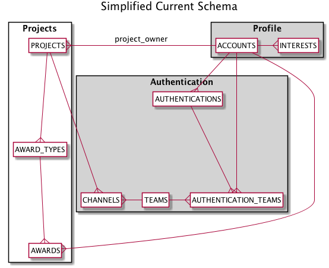
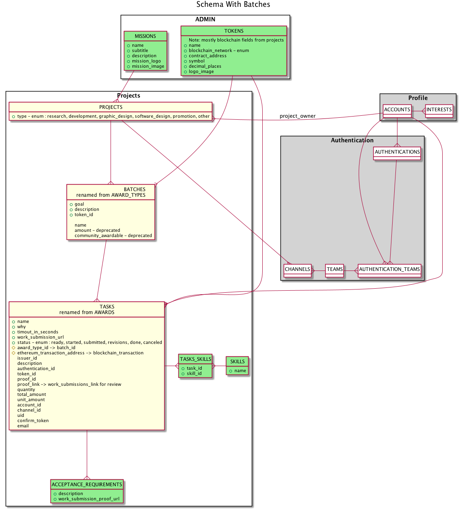

# CoMakery

## Project Vision

CoMakery helps coordinate blockchain missions, projects and token awards.

## Current Implementation Status

This project is in open beta. It is being actively developed by CoMakery.

## Starting Schema


## Future Schema

**Summary of changes**

* Add MISSIONS table
* Add TOKENS table
* Migrate token values currently stored in PROJECTS to TOKENS
* AWARD_TYPES renamed to BATCHES and new fields added
* AWARDS renamed to TASKS and new fields added
* New tables TASK_SKILLS, SKILLS, and ACCEPTANCE_REQUIREMENTS added



## Configuration

We use Rails localization (i18n) for application-specific language.
Every fork of this project will maintain their own `config/locales/app.yml`.

We use environment variables for app "secrets", and values which vary between environments,
eg staging and production.

## Local development

Prerequisites:

- PostgreSQL
- Redis (if you want to run delayed jobs)
- Phantomjs binary in PATH (build from official Ubuntu repo will crash on `attach_file`, more info [here](https://github.com/teampoltergeist/poltergeist))
- Bundler
- Yarn
- Chrome browser

Set up .env:

```sh
cp .env.dev .env
heroku config -a <YOUR_HEROKU_APP> -s | egrep '^(SLACK_|ETHEREUM_|ETHERCAMP_)' | sort >> .env
```

Basics :

```sh
source .env
bundle install
yarn install
chromedriver-update
rails db:create:all
rails db:schema:load
```

Run server:

```sh
rails server
```

or if you want to run with delayed jobs:

```sh
bin/server
```
## React on Rails

* Webpacker
For development, run `bin/webpack-dev-server` command in a terminal separate from `bundle exec rails s` so that the changes made inside react components are updated real time.
However for production, we will use precompiled react code so we don't need to run webpack-dev-server for production mode.
And Webpacker hooks up a new webpacker:compile task to assets:precompile, which gets run whenever you run assets:precompile.
So after running assets precompile, all react components will be working on production mode.

* React_Rails
All react components should be inside app/javascript/components. And you can just use `react_component` helper to render react component and that's all - <%= react_component "Account" %>.
https://github.com/reactjs/react-rails

## Running tests

A bit faster: `bin/rspec`

More thorough (integrates views): `bin/rspect`

JS tests via Jest: `yarn test`

## Pushing code to Github

To run your tests and git push your branch *only if tests pass*, run `bin/shipit`.

## Deploying to Heroku with app.json
- [](https://heroku.com/deploy?template=https://github.com/CoMakery/comakery-app)
- During setup update API keys and secrets according to environment
- After deployment manually update formation and addons plans according to environment
- Re-run migrations using Heroku CLI, if `heroku-postgresql` plan is upgraded from `hobby-dev`
- Setup DNS and install following addons in case of production or staging environment:
  - https://elements.heroku.com/addons/ssl
  - https://elements.heroku.com/addons/expeditedssl
- Update Cloudfront and Airbrake settings

## Deploying to heroku staging

Once your heroku user has access to the applications, you can run any of:

```
citizen deploy staging master comakery
```

## Deploying to heroku production

Show the down for mmaintainence page, backup the production db and confirm.

```
heroku maintenance:on
heroku pg:backups:capture HEROKU_POSTGRESQL_BROWN --app comakery-production
heroku pg:backups --app comakery-production
```

After you have your backup captured, deploy to production:
```
citizen deploy production master comakery
```

The deploy also runs `rake db:migrate` and `heroku maintenance:off --app comakery-poduction`

**TODO:** Fix bin/deploy which calls citizen. It should take more intuitive arguments and give better instructions.
```
bin/deploy staging
bin/deploy production
```

## Basic Auth

Set an environment variable called `BASIC_AUTH` in the format
`<username>:<password>` (e.g., `chewie:r0000ar`). Basic auth will be enabled if
that environment variable exists.

## Sidekiq

Visit <COMAKERY_INSTANCE>/admin/sidekiq

Username admin, password is in heroku app settings

## Scheduled Jobs

On staging and production, we use Heroku Scheduler to run `rails runner bin/patch_ethereum_awards`
on a daily basis.  This task backfills "pending" ethereum awards, if they are no longer retired by Sidekiq.

## Clear and regenerate dead sidekiq jobs

If you are getting an out of memory error for Redis. The processed queue can take up a lot of memory. It can be cleared with `Sidekiq::Stats.new.reset`

If the queue gets backed up or the regenerate script starts duplicating jobs, you can clear it out the Sidekiq job queue by running:

```
Sidekiq::Queue.all.each(&:clear)
Sidekiq::RetrySet.new.clear
Sidekiq::ScheduledSet.new.clear
Sidekiq::Stats.new.reset
Sidekiq::DeadSet.new.clear
```

You can regenerated the jobs manually with:
```
heroku run bundle exec rails runner bin/patch_ethereum_awards --app comakery-staging
```

## Redis Configuration On Heroku

You can find the configuration details at the Heroku Overview Redis To Go link. Notice that this is **redis to go** and **NOT Heroku Redis**. This means that Heroku Redis commands will not work.

You might get an error like `Redis::CommandError: OOM command not allowed when used memory > 'maxmemory'.`

To remove old keys you can do the following. Use the correct environment for your needs.

```
heroku addons -a comakery-staging
```

You will see something like:
```
redistogo (redistogo-spherical-15306)          micro        $5/month   created
 └─ as REDISTOGO
```

More info with:
```
heroku addons:info redistogo-spherical-15306
```

## Flushing Redis Directly

Hopefully you won't need this...

Consider clearing out the Sidekiq Redis jobs using the `Sidekiq::Queue.all.each(&:clear)` and related Sidekiq methods as described in other sections.

You can connect to Redis To Go CLI with:
```
redis-cli -h lab.redistogo.com -p 9968 -a [password]
```

To flush the old keys
```
lab.redistogo.com:9968> flushdb
```

## Github Importer

To create an an award for each git commit in a github project, start by running this command:  
```
importer/git_importer.rb --help                             # local
heroku run -r staging "importer/git_importer.rb --help"     # staging
```

Study the options in help, then construct a command.

**Use only with great care on production!**
If you mistype the project ID, you will import awards into the wrong project.

A full sample command:
```
heroku run -r staging "importer/git_importer.rb --github-repo core-network/client --project-id 1 --ethereum"
```

## Deleting a project

If you want to completely remove all traces of project `p` (be careful):

```ruby
p.award_types.each{|t| t.awards.destroy_all}
p.award_types.destroy_all
p.delete
```
